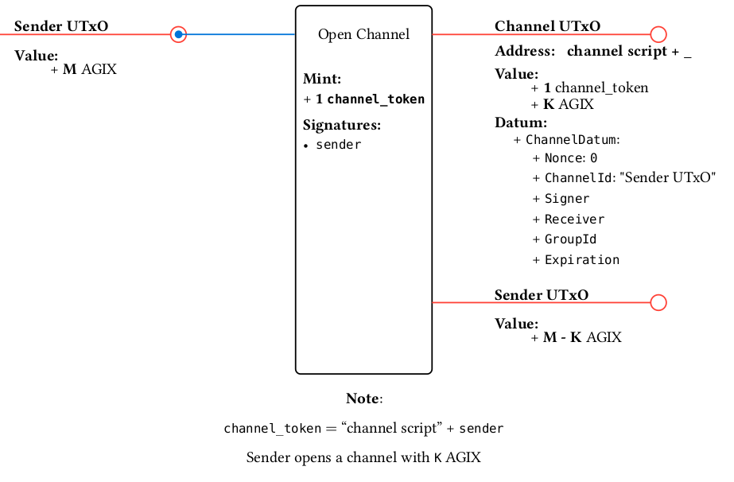
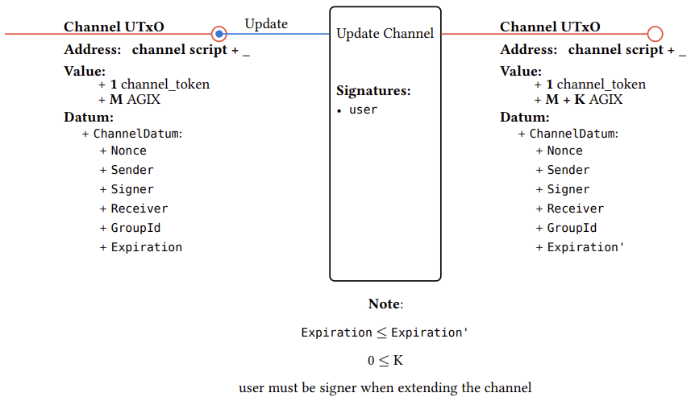
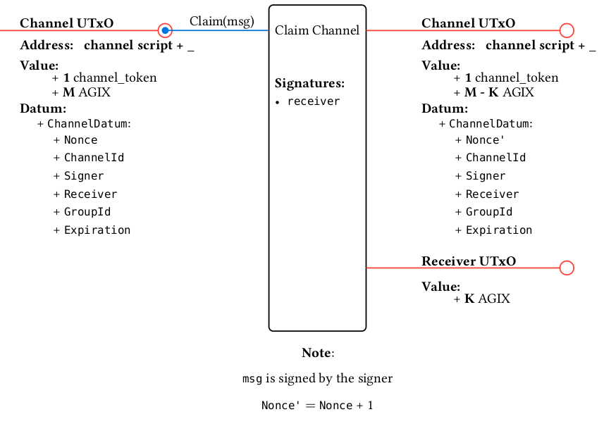
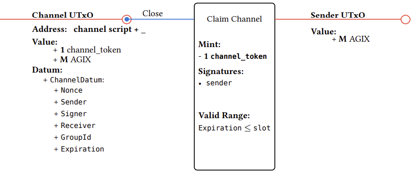

# MultiParty Escrow Design

## Overview
A **channel** represents a “payment relationship” between a sender and a service-provider. There can be many channels between the two. The only token involved is always `AGIX`.
Each channel linking a client to a service provider is represented by a UTxO containing a `channel token`, which is minted upon every channel creation. This `channel token` has a fixed minting policy and its name is the sender's public key hash. The UTxO's datum stores information specific to the channel.
When a channel closes, the `channel token` is burned.
Every transaction interacting with the script will be transparently identified by the action that takes place there.

### Channel UTxO

#### Address
- payment part: [channel script](#validator-script)
- staking part: _

#### Datum
- ChannelId **--txHash+outputIndex of some UTxO reference from an inputs of the open transaction--**
- Nonce **--used to give uniqueness to each signature on claim transactions--**
- Signer Public Key **--used to verify the signatures on claim transactions--**
- Receiver PubkeyHash **--used to verify receiving address--**
- GroupId
- Expiration Date **--used to verify valid ttl of the channel--**

#### Value
- Channel Token
- min-ADA
- AGIX balance on the channel

### Transactions

#### Open
In this transaction, a user creates and deposits AGIX on a payemnt channel. The channel Token is then minted which, as mentioned, is fixed.

#### Update: Extend and/or Add funds
Users can add funds to any non-expired channel, but only the sender can extend its expiration date. The new expiration date must be later than the current one.

#### Claim
Service providers can claim their funds providing the corresponding signed message.

#### Close
A channel can be closed either by the service provider after making a claim or automatically when it expires. After a channel has closed, the sender can reclaim the remaining AGIX in the channel, withdrawing the funds to their wallets.

### Validator
Multivalidator with a minting policy, a spend validator and a withdraw validator.

All channels share the same address, so there is no parameter for the validator.

#### <u>_Minting policy_</u>
##### Mint
* Minting checks:
    * Mints 1 token of this policy, with the sender pub key hash as it's token name.

* Output checks:
    * Enforce channel to be the first output
    * Address:
        * Check output has self script address
        * Stake credential = None
    * Value:
        * Only has only lovelace, AGIX and the minted control token.
    * Datum:
        * ChannelId = txHash + outputIndex of the first input
        * Nonce = 0
        * Expiration date > validity range upper bound
        * Sender = name of the control token
    * Reference script = None

* Other: A positive non-zero amount of AGIX?

##### Burn
* Minting checks:
    * If amount burned == -1, True
    * Else if amount < -1, check Withdraw validator running.

#### <u>_Spend validator_</u>
##### Update
* Minting checks:
    * No tokens with this policy are minted nor burned

* Transaction checks:
    * Only one script input of self address
    * Check channel is still valid (expiration date > validity range upper bound)
    * Sender signing the tx IF the expiration date is updated

* Output checks:
    * Enforce channel to be the first output
    * Address:
        * Output preserves script address
    * Value:
        * without_lovelace(Output value) = without_lovelace(Input value) + K AGIX, where K >= 0
    * Datum:
        * output expiration date >= input expiration date
        * rest of the datum remains unchanged
    * Reference script = None

##### Claim
* Minting checks:
    * No tokens with this policy are minted nor burned

* Transaction checks:
    * Signed by the receiver

* Check withdraw validator is running

##### Close
* Minting checks:
    * Burns exactly -1 token of self policy.

* Transaction checks:
    * Only one script input of self address.
    * Signer by the sender

* Input Checks:
  * Datum:
      * expiration date > validity range upper bound

#### <u>_Withdraw validator_</u>
Only used for claim transactions.

The way to validate this is by mapping each input to its corresponding output, that is, the output at index 1 corresponds to the input at index 1, the output at index 2 to the input at index 2, and so on.

For each script input:
* If the redeemer for this input indicates to Close the channel, validate:
    * corresponding output address = sender address
    * corresponding output value = Input value - claimed amount - channel token
    * channel token is burned
* If the redeemer indicates not to Close the channel, validate over the corresponding output:
    * Address = input address
    * Value = input value - claimed amount
    * Datum:
        * Output nonce = input nonce + 1
        * Rest of the datum remains unchanged
    * Reference script = None
* Verify signature in the redeemer